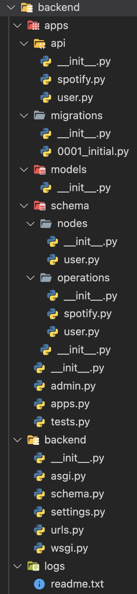

# MÜSIK

- [Django](#django-graphql-api)
  - [Pipenv](#pipenv)
  - [Django basic](#create-django-project-and-apps)
  - [Django structure](#directoriesfiles-to-addmodify)
  - [Database](#database)
  - [Test project](#view-project)
  - [Test graphiQL](#test-gql-request)
  - [Gunicorn](#set-up-gunicorn)
  - [Nginx](#set-up-nginx)
  - [Bash & alias](#bash-scripts-and-alias)

<br/>
<br/>

Frontend : https://github.com/ulysse-lacour/Jolify-front

<br/>

Process to create your django graphql backend API.

- Local graphiQL interface acces via : http://localhost:8000/graphql/
- Local admin interface access via : http://localhost:8000/admin/

<br/>

Related docs :

- My server doc/repo : https://github.com/ulysse-lacour/Server_sd-163666

- DJANGO : https://docs.djangoproject.com/en/4.1/

- GRAPHQL : https://www.howtographql.com/

- GRAPHENE : https://docs.graphene-python.org/en/latest/

- JWT : https://django-graphql-jwt.domake.io/index.html

<br/>
<br/>

## PIPENV

#### Activate/create env :

```bash
pipenv shell
```

<br/>

#### Run command within shell :

```bash
pipenv run command_name
```

<br/>

#### Install packages :

```bash
pipenv install package_name
```

You cand add _--dev_ after package_name for packages not suited for production
Or install all packages from Pipfile with :

```bash
pipenv install
```

To check your current dependency tree :

```bash
pipenv graph
```

<br/>

#### Create .lock for production :

```bash
pipenv lock
```

<br/>

#### Deactivate env :

```bash
exit
```

[**Documentation**](https://realpython.com/pipenv-guide/)

<br/>
<br/>

## Create Django project and apps

Make sure your virtualenv is activated !

Add needed packages (with version needed) to Pipfile then run _pipenv install_.

Create Django project with :

```bash
django-admin startproject backend
```

Then _cd backend_ (once, same level as manage.py and create apps with :

```console
django-admin startapp apps
```

<br/>
<br/>

## Directories/files to add/modify

```
backend/
    schema.py

apps/
    models.py (NEED TO BE DELETED)
    views.py (NEED TO BE DELETED)

    api/
        __init__.py
        api_name.py

    models/
        __init__.py (NOT EMPTY)

    schema/
        __init__.py (NOT EMPTY)

        nodes/
            __init__.py
            node_name.py

        operations/
            __init__.py
            operation_name.py

logs/
    readme.txt
```

### Example :

<details>
  <summary>See image</summary>



</details>

<br/>
<br/>

### Update _backend/urls.py_

<details>
  <summary>Code</summary>

<br/>

```python
from django.contrib import admin
from django.urls import path
from django.views.decorators.csrf import csrf_exempt
from graphene_django.views import GraphQLView

urlpatterns = [
    path('admin/', admin.site.urls),
    path('graphql/', csrf_exempt(GraphQLView.as_view(graphiql=True))),
]
```

</details>

### Update _backend/settings.py_

<details>
  <summary>Code</summary>

<br/>

Modify/add :

```python
ALLOWED_HOSTS = ['domain_or_IP', 'other_domain_or_IP', . . ., 'localhost']
```

```python
INSTALLED_APPS = [
    ...
    'graphene_django',
    'graphql_jwt.refresh_token.apps.RefreshTokenConfig',
    'apps',
    ...
]
```

```python
MIDDLEWARE = [
    ...
    #after this
    'django.contrib.sessions.middleware.SessionMiddleware',
    # this is the line to add
    'corsheaders.middleware.CorsMiddleware',
    # before this
    'django.middleware.common.CommonMiddleware',
    ...
]
```

```python
import os

STATIC_URL = '/static/'
STATIC_ROOT = os.path.join(BASE_DIR, 'static/')
```

```python
GRAPHENE = {
    'SCHEMA': 'backend.schema.schema',
    'MIDDLEWARE': [
        'graphql_jwt.middleware.JSONWebTokenMiddleware',
    ],
}

AUTHENTICATION_BACKENDS = [
    'graphql_jwt.backends.JSONWebTokenBackend',
    'django.contrib.auth.backends.ModelBackend',
]

CORS_ALLOWED_ORIGINS = [
    "http://localhost:3000",
    "http://127.0.0.1:3000"
]

CSRF_TRUSTED_ORIGINS = [
    "http://localhost:3000",
    "http://127.0.0.1:3000"
]

AUTH_USER_MODEL = 'apps.User'
```

Replace :

```python
DATABASES = {
    'default': {
        'ENGINE': 'django.db.backends.sqlite3',
        'NAME': BASE_DIR / 'db.sqlite3',
    }
}
```

With

```python
DATABASES = {
    'default': {
        'ENGINE': 'django.db.backends.postgresql_psycopg2',
        'NAME': 'my_project',
        'USER': 'my_project_user',
        'PASSWORD': 'my_project_password',
        'HOST': 'localhost',
        'PORT': '',
    }
}
```

</details>

### Update _backend/schema.py_

<details>
  <summary>Code</summary>

<br/>

```python
import graphene
import graphql_jwt

import apps.schema as schema


class Query(schema.Query, graphene.ObjectType):
    pass


class Mutation(schema.Mutation, graphene.ObjectType):
    token_auth = graphql_jwt.ObtainJSONWebToken.Field()
    verify_token = graphql_jwt.Verify.Field()
    refresh_token = graphql_jwt.Refresh.Field()


schema = graphene.Schema(query=Query, mutation=Mutation)
```

</details>

### Replace _apps/admin.py_

<details>
  <summary>Code</summary>

<br/>

```python
from django.contrib import admin
from django.contrib.auth.admin import UserAdmin
from apps.models import User

admin.site.register(User, UserAdmin)
```

</details>

### Update _apps/schema/init.py_

<details>
  <summary>Code</summary>

<br/>

```python
from apps.schema.nodes.user import UserNode
from apps.schema.operations import user
from apps.schema.operations import spotify

TYPES = [
    UserNode
]

class Mutation(
    user.Mutation,
    spotify.Mutation,
):
    pass

class Query(
    user.Query,
):

    pass
```

</details>

### Update _apps/schema/operations/user.py_

<details>
  <summary>Code</summary>

<br/>

```python
import graphene

from graphene import ResolveInfo

from apps.schema.nodes.user import UserNode
from apps.api.user import UserAPI
from apps.models import User


class Query(graphene.ObjectType):
    whoami = graphene.Field(UserNode)
    users = graphene.List(UserNode)

    def resolve_whoami(self, info):
        user = info.context.user
        # Check to to ensure you're signed-in to see yourself
        if user.is_anonymous:
            raise Exception('Authentication Failure: Your must be signed in')
        return user

    def resolve_users(self, info):
        return User.objects.all()


class CreateUser(graphene.Mutation):
    class Arguments:
        username = graphene.String()
        password = graphene.String()
        firstName = graphene.String()
        lastName = graphene.String()
        email = graphene.String()

    success = graphene.Boolean()
    token = graphene.String()
    refresh_token = graphene.String()
    details = graphene.String()

    def mutate(self, info: ResolveInfo, **kwargs):
        create_user = UserAPI.create_user(
            mutation_input=kwargs,
            context=info.context
        )

        return CreateUser(
            success=create_user.get("success"),
            token=create_user.get("token"),
            refresh_token=create_user.get("refresh_token"),
            details=create_user.get("details"),
        )


class LoginUser(graphene.Mutation):
    class Arguments:
        username = graphene.String()
        password = graphene.String()

    success = graphene.Boolean()
    token = graphene.String()
    refresh_token = graphene.String()
    details = graphene.String()

    def mutate(self, info: ResolveInfo, **kwargs):
        login_user = UserAPI.login_user(
            mutation_input=kwargs,
            context=info.context
        )

        return LoginUser(
            success=login_user.get("success"),
            token=login_user.get("token"),
            refresh_token=login_user.get("refresh_token"),
            details=login_user.get("details"),
        )


class LogoutUser(graphene.Mutation):
    success = graphene.Boolean()
    details = graphene.String()

    def mutate(self, info: ResolveInfo):
        logout_user = UserAPI.logout_user(context=info.context)

        return LogoutUser(
            success=logout_user.get("success"),
            details=logout_user.get("details"),
        )


class Mutation(graphene.ObjectType):
    create_user = CreateUser.Field()
    login_user = LoginUser.Field()
    logout_user = LogoutUser.Field()
```

</details>

### Update _apps/schema/nodes/user.py_

<details>
  <summary>Code</summary>

<br/>

```python
from graphene_django import DjangoObjectType
from apps.models import User


class UserNode(DjangoObjectType):
    """ Node for User model """
    class Meta:
        model = User
        name = 'User'
```

</details>

### Update _apps/models/init.py_

<details>
  <summary>Code</summary>

<br/>

```python
from django.db import models
from django.contrib.auth.models import AbstractUser


class User(AbstractUser):
    """ User model, extends basic User model with some custom fields. """
    nick_name = models.CharField(max_length=100, verbose_name='Surnom')
    profile_picture = models.ImageField(verbose_name='Photo de profil')
```

</details>

### Update _apps/api/user.py_

<details>
  <summary>Code</summary>

<br/>

```python
from django.contrib.auth import authenticate, login, logout
from typing import Any, Dict
from graphql_jwt.shortcuts import create_refresh_token, get_token

from django.http import HttpRequest

from apps.models import User


class UserAPI:

    @staticmethod
    def create_user(
        mutation_input: Dict[str, Any],
        context: HttpRequest,
    ) -> Dict[str, Any]:
        username = mutation_input.get("username")
        password = mutation_input.get("password")
        firstName = mutation_input.get("firstName")
        lastName = mutation_input.get("lastName")
        email = mutation_input.get("email")
        success = False
        token = None
        refresh_token = None

        if username is None or password is None:
            details = "Input malformed !"
            return {"success": success, "token": token, "refresh_token": refresh_token, "details": details}

        user = User.objects.filter(username=username).exists()

        if user:
            details = "User already exist !"
        else:
            user = User(username=username, first_name=firstName, last_name=lastName, email=email)
            user.set_password(password)
            user.save()
            token = get_token(user)
            refresh_token = create_refresh_token(user)
            success = True
            details = f"User {username} created successfully !"

        return {"success": success, "token": token, "refresh_token": refresh_token, "details": details}

    # TODO : improve error handling

    @staticmethod
    def login_user(
        mutation_input: Dict[str, Any],
        context: HttpRequest,
    ) -> Dict[str, Any]:
        username = mutation_input.get("username")
        password = mutation_input.get("password")

        user = authenticate(context, username=username, password=password)

        if user is not None:
            login(context, user)
            token = get_token(user)
            refresh_token = create_refresh_token(user)
            success = True
            details = f"User {username} logged in !"
        else:
            token = None
            refresh_token = None
            success = False
            details = "Error in either password or username !"

        return {"success": success, "token": token, "refresh_token": refresh_token, "details": details}

    @staticmethod
    def logout_user(
        context: HttpRequest,
    ) -> Dict[str, Any]:
        logout(context)

        return {"success": True, "details": "NONE"}
```

</details>

<br/>
<br/>

## Database

Make sure _backend/settings.py_ has the right config for our postgres database!

<br/>

**SERVER PROCEDURE :**

#### Login to Postgres

```bash
sudo -u postgres psql
```

<br/>

#### Create database for project

```sql
CREATE DATABASE my_project;
```

<br/>

#### Create user

```sql
CREATE USER my_project_user WITH PASSWORD 'password';
```

<br/>

#### Alter role with Django prerequisite

```sql
ALTER ROLE my_project_user SET client_encoding TO 'utf8';
ALTER ROLE my_project_user SET default_transaction_isolation TO 'read committed';
ALTER ROLE my_project_user SET timezone TO 'UTC';
```

<br/>

#### And grant privileges to user on the database

```sql
GRANT ALL PRIVILEGES ON DATABASE my_project TO my_project_user;
```

<br/>

#### Exit postgres

```bash
\q
```

<br/>

#### Migrate

```console
python manage.py makemigrations apps
python manage.py migrate
```

<br/>
<br/>

**LOCAL PROCEDURE :**

#### Create role/user

```bash
psql -d postgres -c "CREATE ROLE my_project_user WITH LOGIN PASSWORD 'password';"
```

<br/>

#### Create database

```bash
psql -d postgres -c "CREATE DATABASE my_project WITH OWNER my_project_user;"
```

<br/>

#### Migrate and create superuser

Make sure to be in your virtualenv !

```console
python manage.py makemigrations apps
python manage.py migrate

```

<br/>
<br/>

## View project

Inside you virtualenv !

<br/>
<br/>

### Collect static

Make sure to have static config in _settings.py_.

```python
import os

STATIC_URL = '/static/'
STATIC_ROOT = os.path.join(BASE_DIR, 'static/')
```

You can then run collectstatic to allow nginx to serve those files.

```python
python manage.py collectstatic
```

<br/>
<br/>

**LOCAL PROCEDURE :**

### Launch local server :

```bash
python manage.py runserver
```

Acces it via : **http://localhost:8000**

<br/>
<br/>

**SERVER PROCEDURE :**

### Launch dev server :

```bash
python ~/my_project_dir/manage.py runserver 0.0.0.0:8000
```

Acces it via : **http://server_domain_or_IP:8000**

### Test gunicorn :

```bash
gunicorn --bind 0.0.0.0:8000 my_project.wsgi
```

With gunicorn test static folder won't be loaded.

Make sure to exit your python environment before dealing with nginx and gunicorn files.

<br/>
<br/>

## Test GQL request

With graphiQL : http://localhost:8000/graphql/ or http://domain_name:8000/graphql/

### Test mutation

```graphQL
mutation {
  createUser(password: "1234567890", username: "test1") {
    success
    details
    token
    refreshToken
  }
}
```

#### Test query

```graphQL
query {
  users {
    id
    password
    lastLogin
    isSuperuser
    username
    firstName
    lastName
    email
    isStaff
    isActive
    dateJoined
    nickName
    profilePicture
  }
}
```

<br/>
<br/>

## Set up gunicorn

### Create socket file :

```bash
sudo nano /etc/systemd/system/my_project.socket
```

Add :

```
[Unit]
Description=my_project socket

[Socket]
ListenStream=/run/my_project.sock

[Install]
WantedBy=sockets.target
```

### Create service file

To find env name look for _pipenv shell_ path

```bash
sudo nano /etc/systemd/system/my_project.service
```

Add :

```
[Unit]
Description=gunicorn daemon
Requires=my_project.socket
After=network.target

[Service]
User=linux_user
Group=www-data
WorkingDirectory=/home/linux_user/django/my_project/
ExecStart=/home/linux_user/.local/share/virtualenvs/my_project_ENV/bin/gunicorn \
          --access-logfile - \
          --workers 3 \
          --bind unix:/run/my_project.sock \
          my_project.wsgi:application

[Install]
WantedBy=multi-user.target
```

### Start and enable socket file :

This will create the socket file at /run/my_project.sock. When a connection is made to that socket, systemd will automatically start the my_project.service to handle it.

```bash
sudo systemctl start my_project.socket
sudo systemctl enable my_project.socket
```

Check if it worked :

Get socket status :

```bash
sudo systemctl status my_project.socket
```

Should return something like :

> ● my_project.socket - my_project socket
> Loaded: loaded (/etc/systemd/system/my_project.socket; enabled; vendor prese>
> Active: active (listening) since Fri 2020-06-26 17:53:10 UTC; 14s ago
> Triggers: ● my_project.service
> Listen: /run/my_project.sock (Stream)
> Tasks: 0 (limit: 1137)
> Memory: 0B
> CGroup: /system.slice/my_project.socket

Check if .sock is there :

```bash
file /run/my_project.sock
```

Should return :

> /run/my_project.sock: socket

If some errors appears check the socket log :

```bash
sudo journalctl -u my_project.socket
```

If everything's allright with socket check for .service mechanism :

```bash
sudo systemctl status my_project
```

Should return :

> ● my_project.service - my_project daemon
> Loaded: loaded (/etc/systemd/system/my_project.service; disabled; vendor preset: enabled)
> Active: inactive (dead)

To activate it request via :

```bash
curl --unix-socket /run/my_project.sock localhost
```

You should receive raw HTML of the project, check again .service status via :

```bash
sudo systemctl status my_project
```

> Active: inactive (dead)
> Should now be :
> Active: active (running)

If you did any changes to either .socket or .service files :

```bash
sudo systemctl daemon-reload
sudo systemctl restart my_project
```

<br/>
<br/>

## Set up nginx

### Create server block :

```bash
sudo nano /etc/nginx/sites-available/my_project
```

And add :

```nginx
server {
    listen 80;
    server_name IP adress or domain name;

    access_log /home/eljovial/django/my_project/logs/access.log;
    error_log /home/eljovial/django/my_project/logs/error.log error;

    location = /favicon.ico { access_log off; log_not_found off; }
    location /static/ {
        root /home/eljovial/django/my_project;
    }

    location / {
        proxy_pass http://unix:/run/my_project.sock;
        include proxy_params;
    }
}
```

You may need to comment (#) _include proxy_params;_ for a subdomain.

### Link to sites-enabled :

```bash
sudo ln -s /etc/nginx/sites-available/my_project /etc/nginx/sites-enabled
```

### Check for syntax errors :

```bash
    sudo nginx -t
```

### Restart nginx :

```bash
sudo systemctl restart nginx
```

Or you can restart nginx with _bash ~/restart_nginx.sh_

<br/>
<br/>

## Bash scripts and alias

For each project you cand add to _~/.profile_ :

```bash
alias my_project-log="sudo journalctl -u my_project -n 150"
alias my_project-reboot="sudo systemctl daemon-reload && sudo systemctl restart my_project.socket my_project"
alias my_project-status="sudo systemctl status my_project"
```
